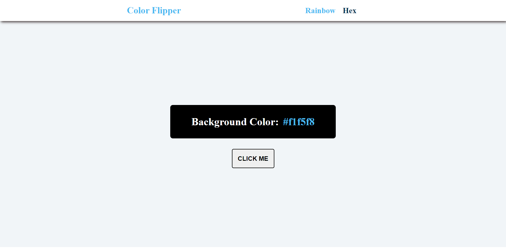

# 15 Vanilla JavaScript Projects

This project is a part of 15 vanilla JavaScript projects.

## Table of contents

- [Overview](#overview)
  - [Screenshot](#screenshot)
  - [Links](#links)
- [My process](#my-process)
  - [Built with](#built-with)
  - [What I learned](#what-i-learned)
- [Author](#author)

## Overview

### Screenshot

### Links

- [View live](https://junaidshaikh-js.github.io/color-flipper/)

## My process

### Built with

- Semantic HTML5 markup
- [Sass](https://sass-lang.com/) - CSS extension language
- CSS Flexbox
- JavaScript

### What I learned

I learn creating hex colors usign Javascript and brushed up my knowledge about working with DOM.

## Author

- Linkedin - [@junaidshaikhjs](https://www.linkedin.com/in/junaidshaikhjs/)
- Twitter - [@junaidshaikh_js](https://twitter.com/junaidshaikh_js)
